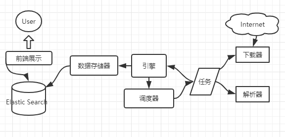

### 知名项目：
- Docker
- Kubernetes
- Caddy(server)
- CockroachDB(DB)
- beego(web框架)

### 设计初衷：
- 并发编程
- 为大数据，微服务，并发而生

### 特性：
- 没有对象，没有继承多态，没有泛型，没有try/catch
- 有接口，函数式编程，CSP并发模型（goroutine + channel）

### 基本语法：
- 变量
- 选择，循环
- 指针，数组，容器

### 面向接口：
- 结构体
- duck typing的概念
- 组合的思想

### 函数式编程：
- 闭包的概念

### 工程化：
- 资源管理，错误处理
- 测试和文档
- 性能调优

### 并发编程：
- goroutine和channel
- 理解调度器

## 项目
Internet --> 分布式爬虫 --> Elastic Search (Docker) <-- 简单前端

### 项目架构：


### 面向对象
```text
仅支持封装，不支持继承和多态
面向接口编程
没有class，只有struct

type TreeNode struct {
    Left, Right *TreeNode
    Value int
}
```


